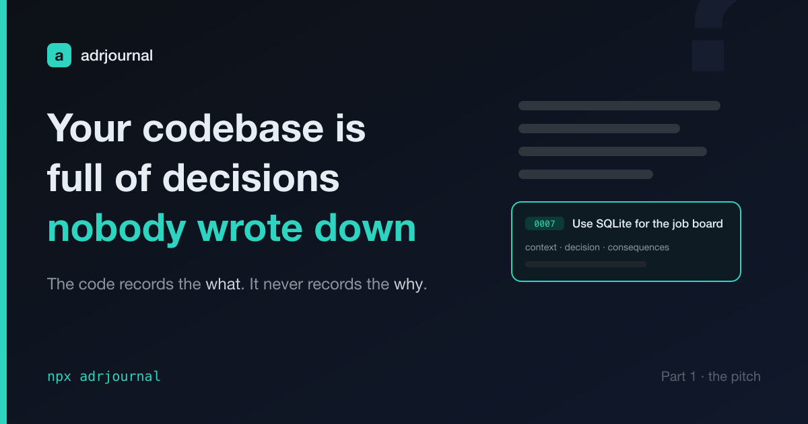

# adrjournal: Your Codebase Is Full of Decisions Nobody Wrote Down

I build with AI now, and it changed one thing more than anything else: volume. I
ship more code, faster, than I ever did by hand. The code keeps up. The
*reasoning* doesn't.

Every architecture has a paper trail that lives only in someone's head. Why
SQLite and not Postgres. Why this module owns that responsibility. Why we tried
the obvious thing and threw it away. Code records *what* you did. It never
records *why*. That was always a slow leak. With an agent generating a whole
subsystem in an afternoon, it's a flood.

And there's a newer problem, one that only shows up when you build *with* agents:
**your agent has no memory of why either.** Next session it will happily re-open
a decision you settled last week, or quietly break a constraint it can't see. The
"why" has to live somewhere — somewhere both you and your agent can read.

That somewhere is an Architecture Decision Record.

> The complete project is open source: [github.com/jeromeetienne/adrjournal](https://github.com/jeromeetienne/adrjournal)

## One decision, one file

An ADR is Michael Nygard's format. One short markdown file per decision:

- **Context** — the forces that made this necessary.
- **Decision** — what you're doing, plus the alternatives you rejected and *why
  they lost*.
- **Consequences** — what gets easier, what gets harder.

Records are immutable. When a decision changes you don't edit the old one — you
write a new one that supersedes it. So the log is a history, not a snapshot.

I didn't invent a format. I picked a known one on purpose. A standard is
something humans, tools, and agents already understand — and I want to reuse the
same principle for other kinds of documentation later.

## adrjournal makes recording one cheap

adrjournal is a Claude Code skill. You talk to it in plain language and it picks
a mode:

- **scaffold** — set up the ADR log in a repo, once.
- **interview** — "record this decision." A short, focused Q&A, then it writes
  the file.
- **backfill** — "document what we've already built." It fans out subagents to
  mine your existing code and docs, proposes a list of candidate decisions, and
  you curate before anything gets written.

Backfill isn't the situation you want — documenting as you go is always better.
But nobody arrives on a clean codebase. When you inherit ten thousand lines of
undocumented decisions, a tool that reconstructs them beats squinting at `git
blame`.

And because I forget — everyone forgets — there's a nudge. A `Stop` hook that,
when a session shows a real *decision signal* (a new dependency, a new top-level
area, an infra or schema change), reminds you to record it. Once per session,
non-blocking, silent if you already wrote one that session. Insurance, not
nagging.

## Why an agent-builder should care

Here's the part that matters if you build with agents: this log is *for the agent
too*. The ADR directory becomes durable memory. The next time your agent touches
the project it can read why the architecture is the way it is — instead of
guessing, or re-litigating a settled decision.

And under the hood there's a design choice I'll spend the next post on, because
it's the actually interesting part: **the model never does anything that has to
be correct by construction.** Numbering, the index, file creation — all
deterministic code. The model only does what code can't: judgment and prose. You
don't ask a language model to count.

More on that next time.

---

adrjournal is on npm: `npx adrjournal`.
<https://www.npmjs.com/package/adrjournal>
