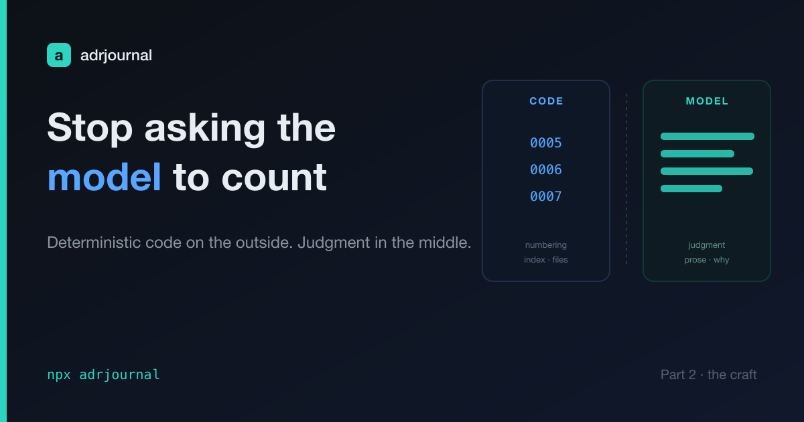

# adrjournal: Stop Asking the Model to Count (The Code-vs-Model Split)

In the [last post](part-1-decisions-nobody-wrote-down.md) I said adrjournal has
one design choice worth stealing. Here it is, as a rule:

> **Never ask the model to do anything that has to be correct by construction.**

A language model is the wrong tool for counting, for uniqueness, for keeping an
index in sync. Not because it's dumb — because it's *probabilistic*. Ask it for
"the next ADR number" ten times and most of the time you get `0007`. The other
times you get `0006` again, or `0008` because it skipped one, or `7` because it
forgot the zero-padding. "Most of the time correct" is exactly the property you
do not want in a filing system. The whole point of an ADR log is that you can
trust it a year from now.

So I didn't hand that to the model. I gave it to code.

> The complete project is open source: [github.com/jeromeetienne/adrjournal](https://github.com/jeromeetienne/adrjournal)



## What code owns

adrjournal ships a small TypeScript CLI. It owns everything mechanical and
boring — the things that must be identical every single time:

- **Numbering** — `next`/`create` compute `NNNN` from the files on disk. Four
  digits, zero-padded, `0000` reserved. No off-by-one, ever.
- **The index** — `reindex` regenerates the table in `README.md` from the
  records. It's derived data, so it's never hand-edited.
- **Scaffolding** — `scaffold` creates the directory, template, and meta-ADR, and
  is idempotent: run it twice, nothing breaks.
- **File creation** — one record, named correctly, from the template.

All of that is deterministic. It's also *testable* — I can unit-test a numbering
function. You cannot unit-test a vibe.

## What the model owns

The model gets the part code can't do: **judgment and prose.**

- The **interview** — asking the few questions that draw out *why* a decision was
  made, and writing it so a human understands it in a year.
- The **alternatives** — naming what you rejected and *why it lost*. That's
  reasoning, not bookkeeping.
- In **backfill**, deciding which of a hundred things buried in a codebase are
  actually *decisions* worth recording. That's taste.

This is where the model's budget should go. Every token spent making it count to
seven is a token not spent on the writing — the only part that needed a mind.

## The seam is the skill

The two halves meet in the skill file. `SKILL.md` doesn't reimplement the
mechanics in prose; it tells the model when to shell out and where to write. The
flow for one record is literally:

```bash
path=$(npx adrjournal create "Use SQLite for the job board")  # code: picks 0007, makes the file
# model: edit $path — fill in context, decision, consequences
npx adrjournal reindex                                        # code: rebuilds the index
```

Code on the outside, judgment in the middle. The model never sees a number it has
to invent, and never touches the index by hand. It does the one thing it's good
at, sandwiched between two things it isn't.

## Steal this

If you're building agents, this is the pattern: **find the deterministic core of
your task, wall it off in code, and spend the model only on what code genuinely
can't do.** It's cheaper, it's more reliable, and it's testable. Most "the AI
made a mistake" bugs I see are really "the AI was asked to do a job that was never
its job."

The model is a reasoning engine. Stop making it a calculator.

Next post: the other half of agent design — not *what* the model does, but *when*
the agent should speak at all. That's the nudge.

---

adrjournal is on npm: `npx adrjournal`.
<https://www.npmjs.com/package/adrjournal>
