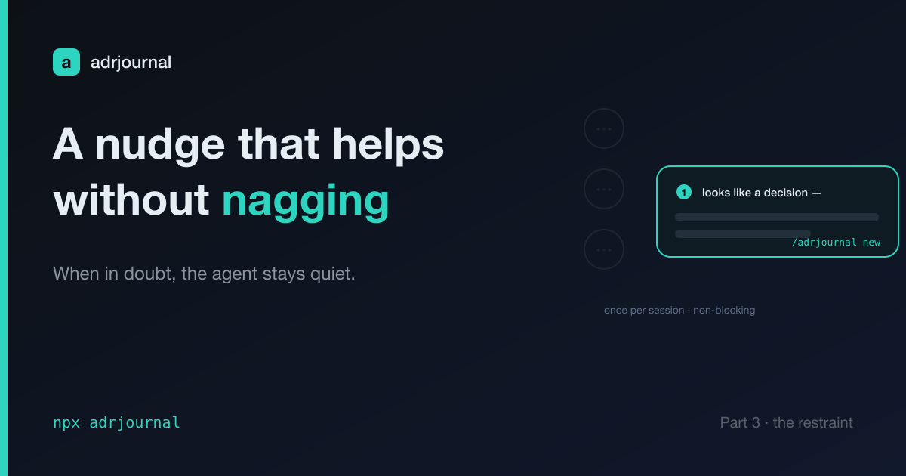

# adrjournal: Designing a Nudge That Helps Without Nagging

Here's the uncomfortable truth about the tool I built: I forget to use it.
Documenting a decision is the kind of thing you mean to do and then don't,
especially on an older repo where you're already three problems deep. A tool that
only works when you remember to reach for it doesn't really work.

So the agent should remind me. Easy, right? Add a reminder.

No. A reminder that fires too often is worse than no reminder, because you turn it
off — and a disabled feature helps you exactly zero times. The real design problem
isn't "remind me to write ADRs." It's: **how does a proactive agent earn the
right to interrupt you?**

That question is most of [agent](part-1-decisions-nobody-wrote-down.md)
[design](part-2-stop-asking-the-model-to-count.md), and the nudge is my answer to
it.

> The complete project is open source: [github.com/jeromeetienne/adrjournal](https://github.com/jeromeetienne/adrjournal)

## What it is

adrjournal registers a `Stop` hook — `npx adrjournal nudge` — that runs when a
session ends. Most of the time it prints nothing. Occasionally it prints one
line: *"This session looks like it made an architectural decision (a dependency
was added). Consider running /adrjournal new to record it."*

That's the whole feature. The interesting part is everything it does to stay
quiet.

## The restraint

Four rules, and they all point the same direction:

1. **Only on a real signal.** Not every change — a *decision* change. A new
   dependency in `package.json`, a brand-new top-level area or package, an
   infra/schema/boundary file (`Dockerfile`, a migration, a `.proto`, a `.tf`).
   These are the moves that usually encode a decision worth a paragraph.
2. **At most once per session.** It drops a marker the first time it fires and
   then says nothing more, no matter how much else happens.
3. **Silent if you already touched an ADR this session.** If there's a change in
   the ADR directory, you clearly didn't forget — so it gets out of your way.
4. **It never blocks and never errors.** A `Stop` hook that breaks the session is
   unforgivable. On *any* failure — not a git repo, bad input, anything — it
   swallows it and stays silent.

## The asymmetry that decides everything

Why bias so hard toward silence? Because the two failure modes don't cost the
same.

A **missed** nudge costs almost nothing. You can always run `/adrjournal new`
yourself; the decision is still there to record tomorrow.

A **false** nudge costs a lot. Annoyance compounds. Three bad reminders and you
disable the hook — and now it helps you zero times, forever.

When the downside of speaking is that much worse than the downside of staying
quiet, the rule writes itself: **when in doubt, shut up.** The nudge would rather
miss a real decision than nag you about a fake one.

## How it knows (the same split, again)

Notice what the nudge does *not* do: it never asks the model "did you make an
architectural decision this session?" That would be slow, expensive, and exactly
the kind of fuzzy judgment a model gives you a different answer to each time.

Instead it reads **git**. Diff against `HEAD`, look for the signals, done. The
detection is deterministic code — the same principle as
[the last post](part-2-stop-asking-the-model-to-count.md). The code decides
*whether there's a signal*; you decide *whether it's worth recording*. Each side
does only what it's good at.

And it's a suggestion, never a command. One line, then it's gone. Proactive, not
pushy.

## The whole series, in one line

Three posts, but really one idea: **give each part of the system exactly the job
it's good at, and nothing more.**

- Counting and indexing → deterministic code.
- Reasoning and prose → the model.
- Speaking up → only when it's clearly earned.

That's the design. The ADR log is just the thing it produces.

---

adrjournal is on npm: `npx adrjournal`.
<https://www.npmjs.com/package/adrjournal>
